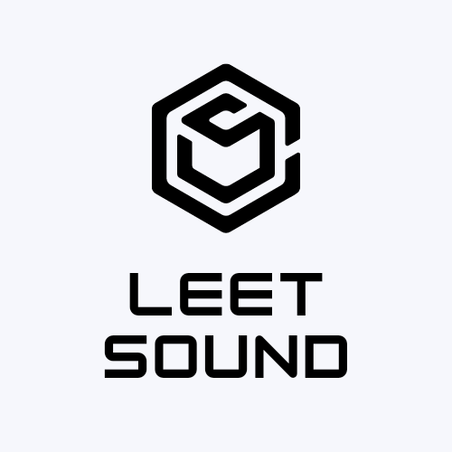

<h1 align="center">leetsound</h1></br>

<p align="center">
:notes:  A JAM stack lossless music streaming site made with Apollo GraphQL, Nexus scxhema, React, Next.js, TypeScript, JWT, Prisma ORM with PostgresDB or SQLite. :headphones:
</p>
<br>

<p align="center">
  <a href="#"></a>
  <a href="#"></a>
  <a href="https://github.com/k4u5h4L"></a>
  <a href="#"></a>
  <a href="#"></a>
  <a href="#"></a>
</p>

<br>
<p align="center">
</img>
</p><br>

## Technologies used:

-   React as the UI library.

-   Next.js as the React framework for auth and stuff.

-   GraphQL as the API language.

-   Prisma ORM with PostgresDB or SQLite.

-   NextAuth as the authentication backend with passwordless logins.

## Prerequisites:

-   Node.js and yarn installed.

## To run:

-   Clone and cd into the repo.

```
git clone https://github.com/k4u5h4L/leetsound.git && cd leetsound
```

-   Install the dependencies

```
yarn install
```

-   Create a new file called `.env` and fill in variables and keys from different providers from the `.env.example` file.

-   Run development server for the site.

```
yarn dev
```

-   Now visit the location [localhost:3000](http://localhost:3000) to check out the site!

## Note:

-   This project is for learning purposes only.

<!-- -   Any contribution is welcome. You may fork the repo and issue a PR. -->
